# Freight Rate Prediction

Solution for the Spotter machine learning assessment. The task is to predict the posted rate for 12,000
truck loads in November and December 2025, using 48,000 labelled loads from January to October 2025, and
to produce the fixed December chart for the Lexington to Fort Wayne lane.

## Files to review

- `validation_predictions.csv`: `load_id,predicted_rate` for all 12,000 loads, in template order
- `data/december_chart_inputs.csv`: the 31 December rows with `predicted_rate` filled in
- `scorer_results/candidate_december.png`: the chart produced by the provided `score.py`
- `report/Freight_Rate_Report.docx`: the written report (validation approach, data split, findings, model, December chart)
- `cleaned-datasets/CLEANING_LOG.md`: every cleaning decision and the evidence behind it
- `cleaned-datasets/MODELING_NOTES.md`: feature and model decisions, with all test results

## How to run

```bash
python3 -m venv env
source env/bin/activate
python -m pip install -r requirements.txt
./run_all.sh
python -m pytest -q
```

`run_all.sh` goes from the raw files to both output files and the chart in about two minutes. It finishes
by running the provided scorer with the command from the assessment README:

```bash
python score.py --predictions validation_predictions.csv --december-predictions data/december_chart_inputs.csv
```

Raw inputs are in `data/`. The assessment brief and its README are in `docs/`.

## Pipeline

| Step | Script | What it does |
|---|---|---|
| 1 | `src/step1_flip_sign.py` | Makes 292 training and 145 validation negative weights positive. The sizes are real weights with a wrong sign. |
| 2 | `src/step2_fill_blanks.py` | Fills blank weights with the training median. Fills blank market_index values with the same-day average. |
| 3 | `src/step3_remove_bad_prices.py` | Removes 677 training rows (1.4%) priced 2 to 5 times too high or 0.2 to 0.5 times too low. Validation is never trimmed. |
| 4 | `src/step4_features.py` | Builds 23 features: log distance, equipment, weight, weekday, a short-term market signal, coordinates, and city effects with a nearest-cities fallback for 8 unseen cities. |
| 5 | `src/step5_model.py` | Compares models on forward-in-time folds. `src/step5_sweep.py` runs the wider sweep. |
| 6 | `src/step6_predict.py` | Fits on all of January to October, applies a 0.6% level anchor, writes both files, runs `score.py`. |

Charts for each step are in `eda/figures/`. `notebooks/01_eda.ipynb` is the exploration walkthrough.

## How the data was split and validated

The task is a forecast: train on January to October, predict November and December. So models were chosen
on forward-in-time folds that copy that shape: train January to August and test September to October, train
January to June and test July to August, train January to July and test August to October, and train January
to September and test October. Every learned part of the pipeline (fill values, city effects, lane terms) is
refitted inside each fold.

A stratified random split was tried first and rejected. It reported 5.4% error for a model with seasonal
features that scored 9.7% when tested on later months. Random splits cannot see anything that changes
over time, and this task is about change over time.

The folds overlap, since September and October appear in three of the four test sets, so differences below
about 0.05 points are not meaningful. The chosen model wins on every fold, not only on average.

## Model

A linear model on log(price), then gradient-boosted trees fitted to its residuals (400 trees, 15 leaves,
early stopping off), then a shrunk per-lane residual mean that is zero for lanes not seen in training.

| Model | Forward-fold error | Worst fold |
|---|---|---|
| Linear, trees on residuals, lane term (chosen) | 1.70% | 1.93% |
| Linear, trees on residuals | 1.76% | 1.97% |
| Linear only | 1.87% | 2.06% |
| Trees only | 1.90% | 2.11% |

Random forest, extra-trees, k-nearest neighbours, a neural net and polynomial ridge were also tried and
none beat the chosen model. CatBoost in the same structure gave 1.71%, a tie. It is not in the provided
requirements, so it was removed again and nothing in the pipeline uses it.

Expected error on genuine November and December prices: about 1.5 to 1.9% if the price level stays where it
was in September and October, which every input suggests, and 3 to 6% if the level shifts. The scored error
will be higher by the share of bad prices in the answer key, since about 1.4% of rows carry prices 2 to 5
times off and cannot be detected without the price.

## Key findings

Each finding links to the chart that shows it. All charts are in `eda/figures/`.

**Price follows distance almost perfectly on log scales** (correlation 0.97). Rate per mile falls from
$2.80 under 200 miles to $1.87 over 2,500 miles. Reefer costs about 12% more per mile than Dry Van,
Flatbed about 8% more. Location is worth about one point of error.

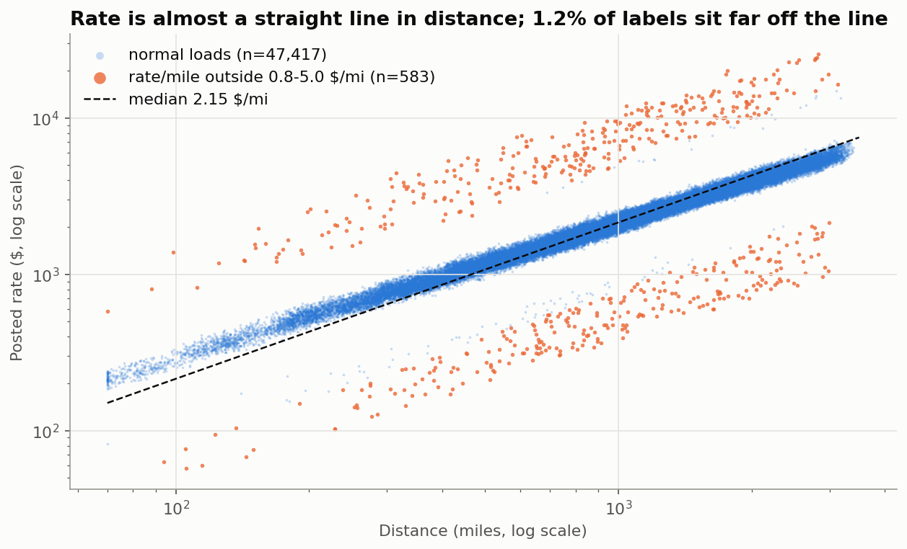
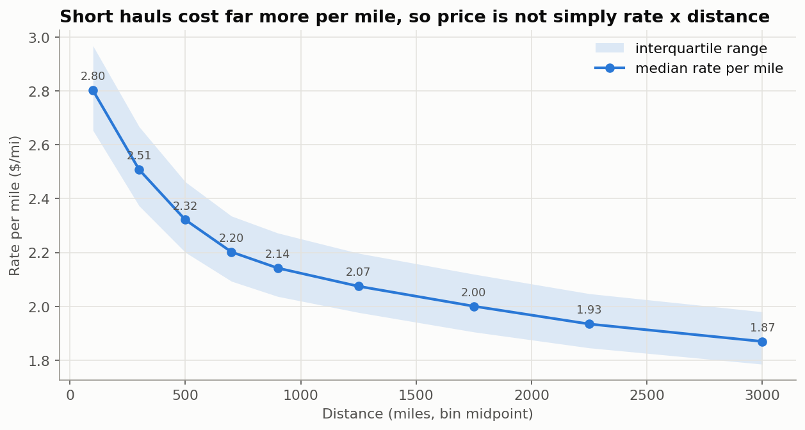
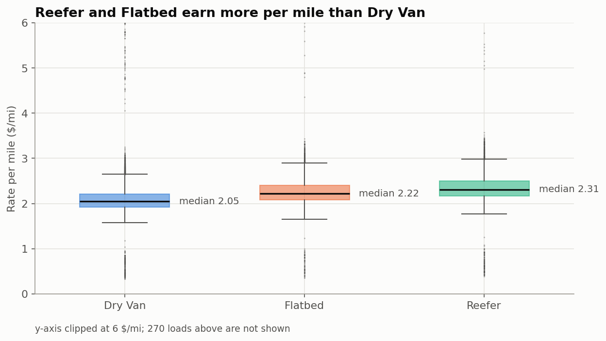

**Prices drift through the year.** Cheapest in January, peak in June, then a plateau. The validation months
are outside the training window, which is why the split must be time based.

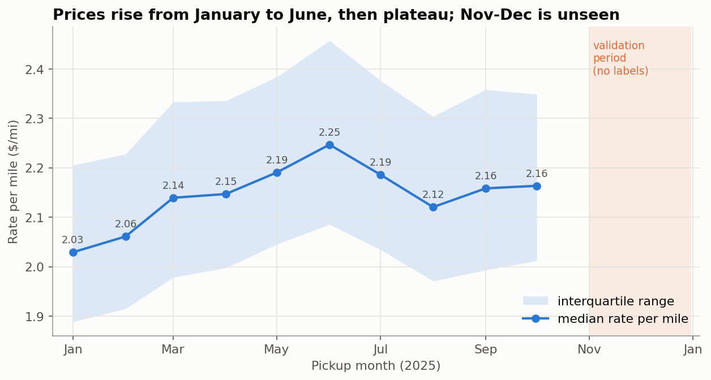

**Four data-quality issues, all small.** Blank weights, blank market_index values, negative weights, and
about 1.4% of prices that are 2 to 5 times off. The same issues appear in the validation file, so the
cleaning is one shared function. The weight sign flip and the bad-price removal are shown below.

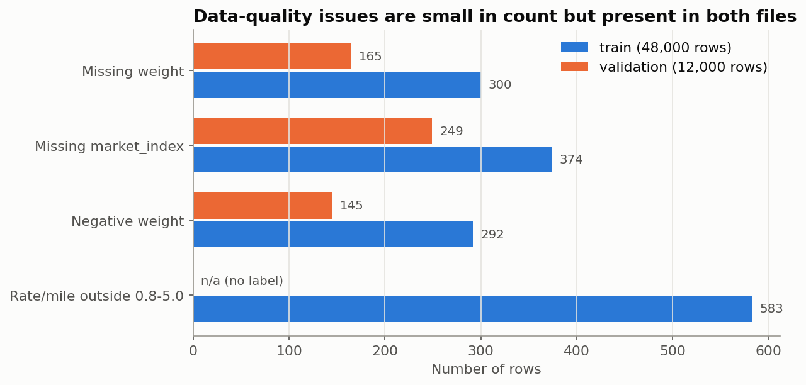
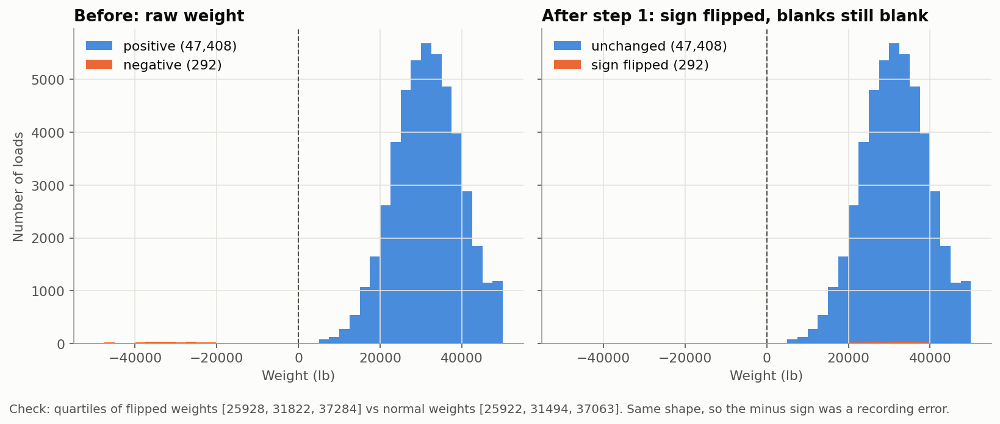
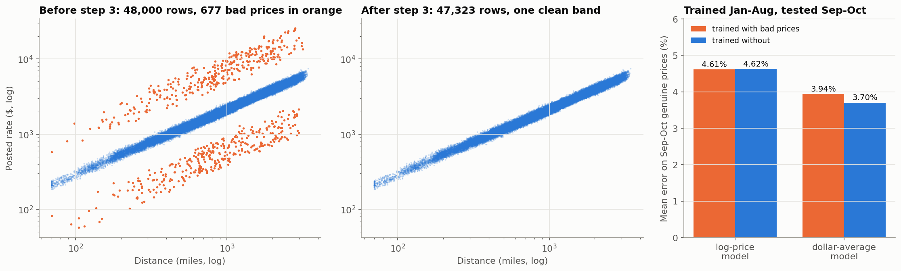

**Eight validation cities never appear in training**, touching 12% of validation rows. Coordinates and a
nearest-cities fallback handle them. The map shows the learned city effects and the fallback values.

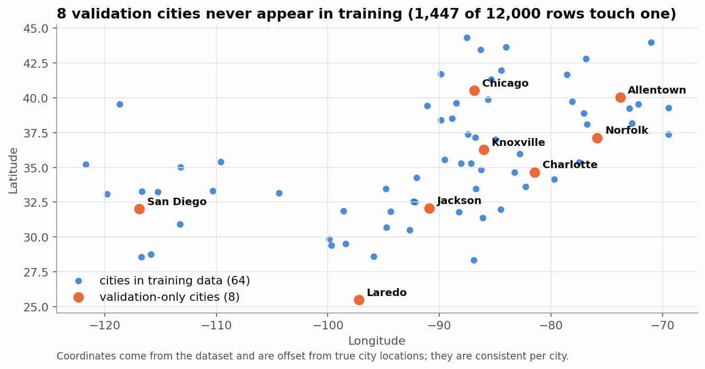
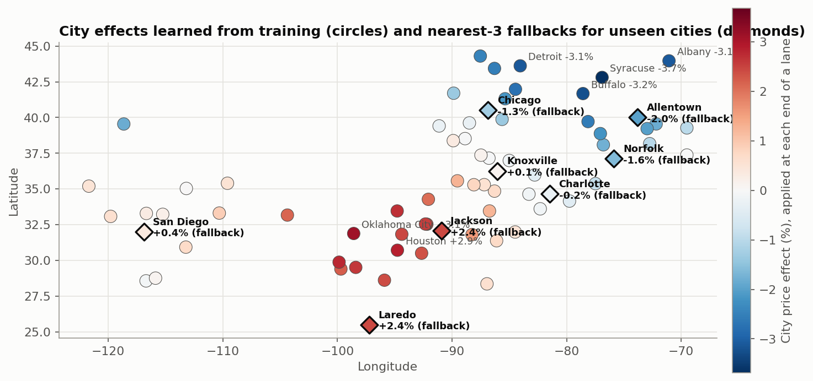

**market_index is a daily market level with a weekly cycle.** Blanks are filled from the same day's
other loads, which recovers hidden values to within 0.016. Used raw it hurts across time, so only its
short-term deviation from a 28-day level is a feature.

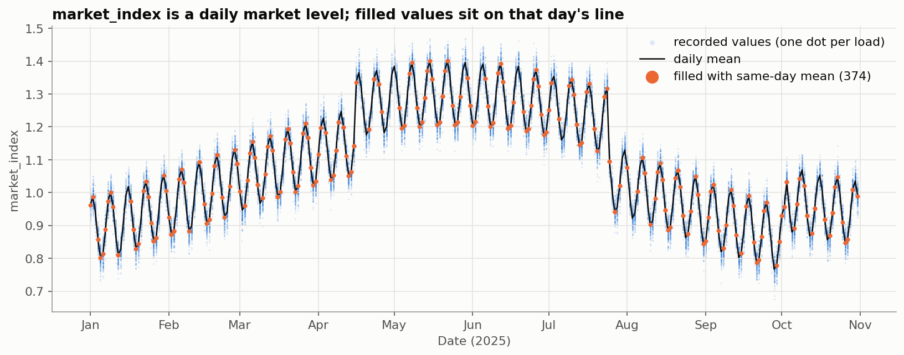
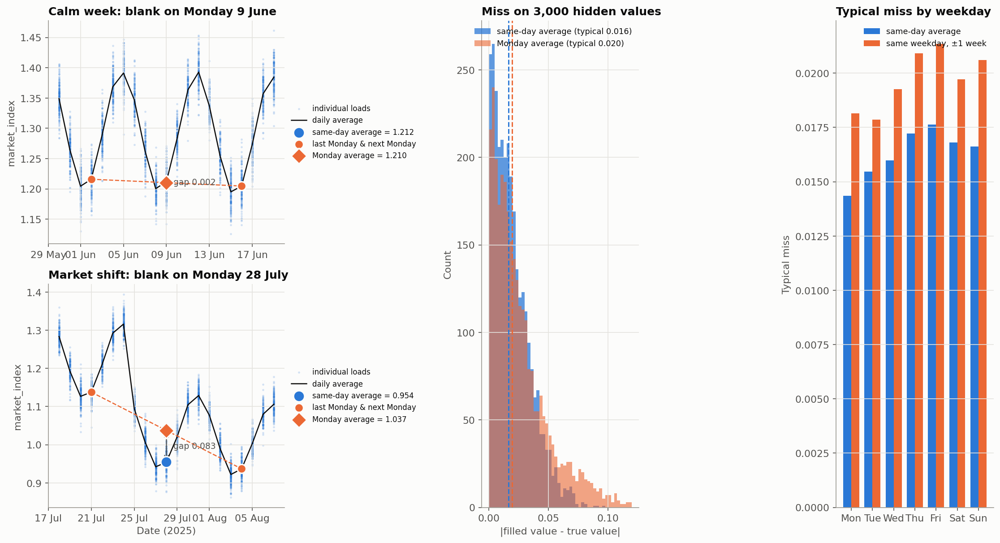

**quote_signal is planted.** In January, February, March, June and September it is the rate per mile and
predicts price with 0.8% error on its own. In April, May, July and October it is 4.15 minus the rate per
mile. In August, November and December it is random. Its correlation with log distance tells the regime
without any prices: about -0.80, +0.81 and 0. November scores 0.009 and December 0.013, so the column is
random for the months being predicted and is left out of the model. Full table in
`cleaned-datasets/MODELING_NOTES.md`.

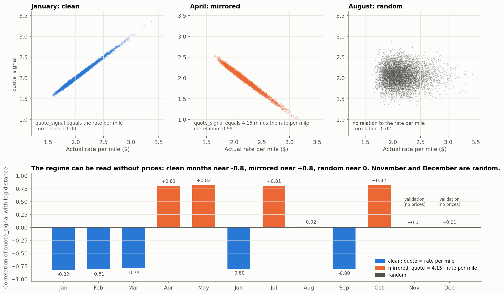

**The chosen model wins on every forward fold.**

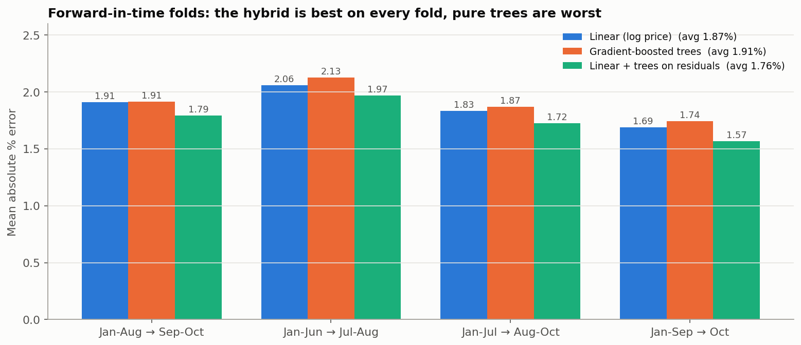

**What drives the December chart.** Only the weekday and the short-term market signal change across the
31 rows, so the chart shows a weekly cycle of about 1% around $833. The training median for Dry Van on
this lane is $808.

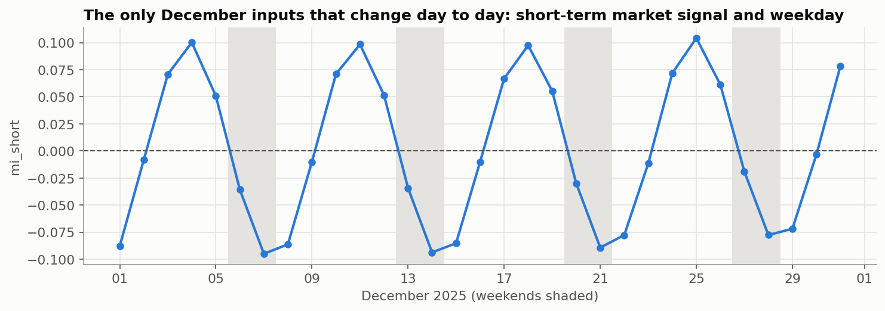
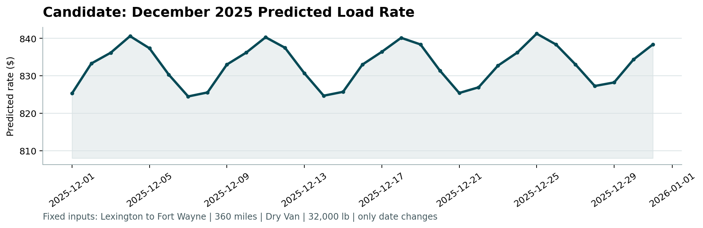

**The error that remains** is about 1% unavoidable row noise, measured from the months where quote_signal
reveals the exact price, plus a day-level drift that none of the inputs can forecast.

## Assumptions

- November and December follow the same rules as January to October. All inputs match September and
  October, and training shows no holiday effects.
- The market signal uses a centred 28-day window, so the model is scored in batch. The validation file
  ships all dates, so this is fine here.
- City effects and the lane term are fitted on the training rows without holding rows out. With about
  1,500 rows per city end this is harmless, and fitting the lane term out of fold was checked and gains
  nothing.
- The weight median in step 2 and the expected prices in step 3 are computed once on all of January to
  October. The leak into the folds is negligible. The city and lane terms, which matter, are refitted per
  fold.
- Predicting log(price) targets the median. That is right for mean absolute error and percentage error,
  and slightly low for root mean squared error. The scoring metric was not given.
